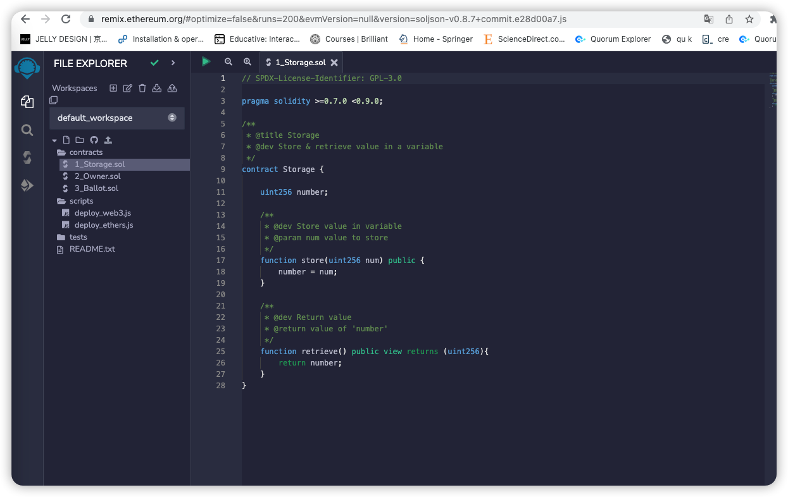
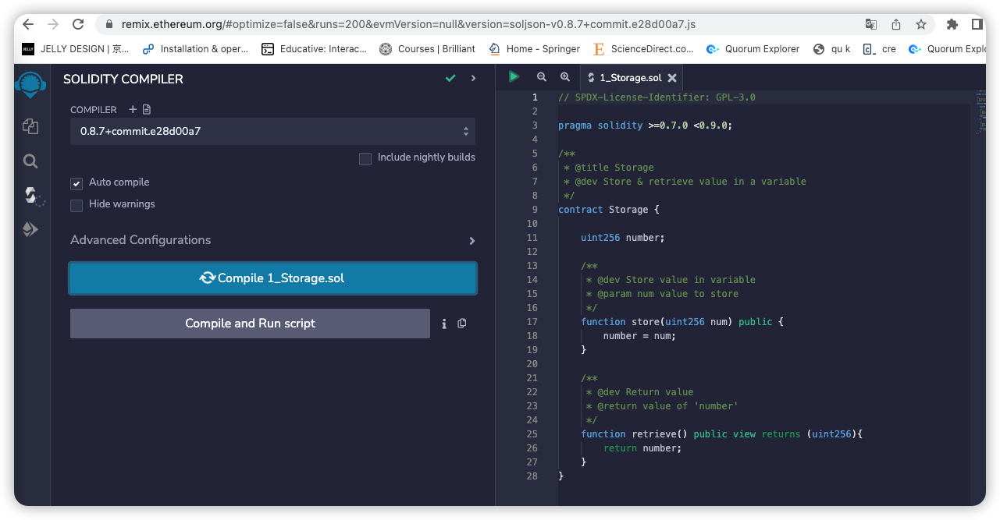

# First Contract: Hello World,Hello Web3

- Understand Basic Contract Lifecycle
- Tools involved in Contract Development Lifecycle

## Remixd - Contract IDE
- online: https://remix.ethereum.org/



- Deploy Contract



```shell
npm install @remix-project/remixd -g
```

```shell
remixd -s ./contracts -u https://localhost:9100 --remix-ide https://remix.ethereum.org

```


### 中文solidity资料推荐：
1. [Solidity中文文档](https://solidity-cn.readthedocs.io/zh/develop/introduction-to-smart-contracts.html)（官方文档的中文翻译）
2. [崔棉大师solidity教程](https://space.bilibili.com/286084162) web3技术教学博主，我看他视频学到了很多 
