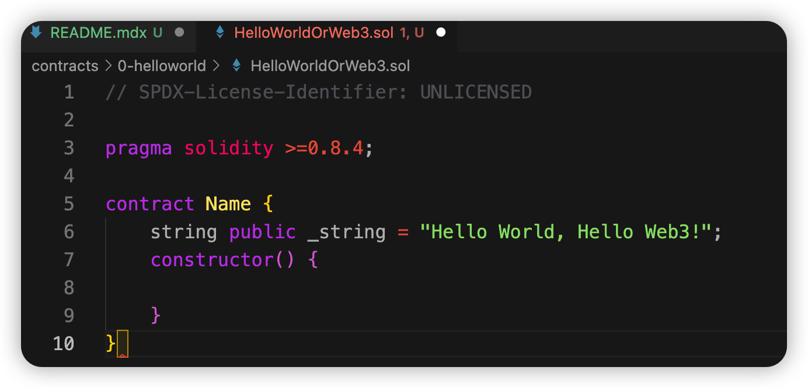

import QuizProgress from '@site/src/components/QuizProgress';
import QuizForm from '@site/src/components/QuizForm';

# Solidity入门:  1. Solidity开发环境搭建

`Solidity`是以太坊虚拟机（`EVM`）智能合约的语言。同时`solidity`是玩链上项目必备的技能：区块链项目大部分是开源的，如果你能读懂代码，就可以自己检查是否有些项目有坑.
目前以太坊虚拟机（`EVM`）被很多不同的区块链使用，不只是公链，国内的联盟链比如长安链等也都支持，所以这是一门通用性语言；当然随着MOVE语言的推出，`solidity`也会受到一定的挑战.

不过从事任何一门语言开发，教程都是通过Hello World开始，但是实际上从开始写代码之前，需要搭建自己的开发环境，对于Solidity开发而言，搭建自己的开发环境，最少需要以下几个工具：

- nodejs
- IDE: VisualStudio Code/WebStorm 
- Solidity运行环境

## 安装环境 - nodejs

不同操作系统会使用不同的安装方式，总体而言就是现在nodejs 安装包安装，最后检查是否安装成功：
1. [nodejs下载地址](https://nodejs.org/zh-cn/download/)
2. 安装完毕之后使用命令行工具确认是否安装成功: ```node -v```,如果版本显示出来，表示安装成功
```sh
node -v
v16.15.0
```
3. 安装IDE(代码开发工具)， VisualStudio Code/WebStorm 
   安装成功之后，安装Solidity语言的插件，方便Solidity语言的高亮展示
4. 安装Solidity运行环境
```sh
npm install -g solc
# MAC 也可以使用
brew update
brew upgrade
brew tap ethereum/ethereum
brew install solidity
```

以上步骤完成之后，最简单的开发环境搭建完成. 使用VS Code编写或者打开Solidity文档，代码就可以高亮展示了.

