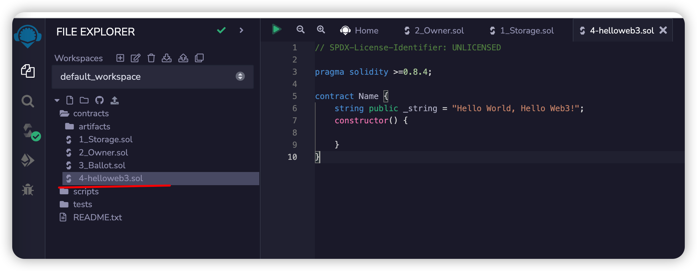
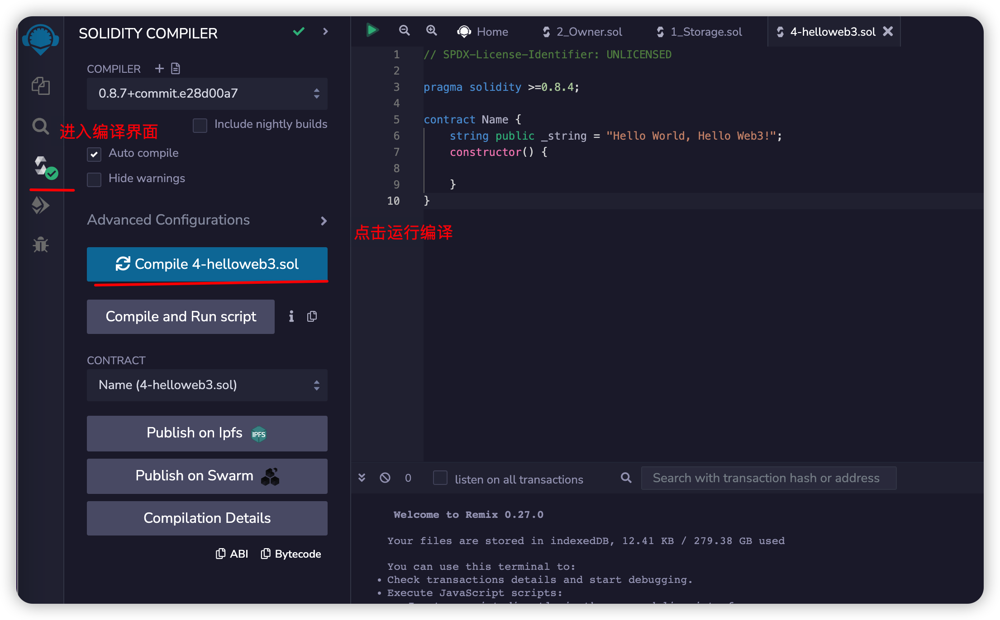
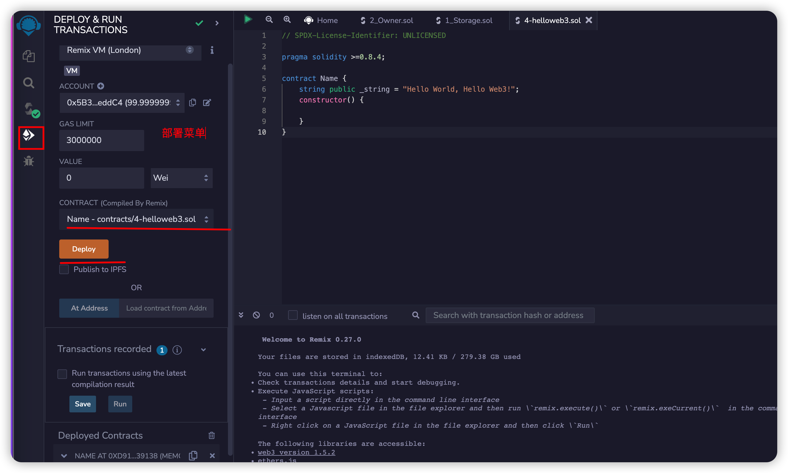
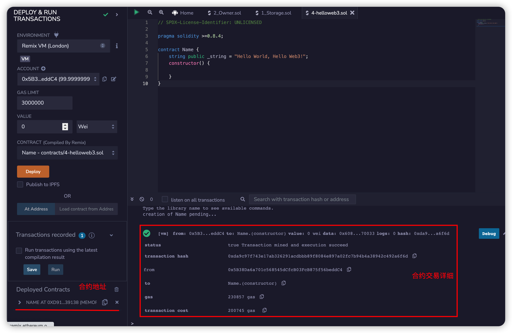
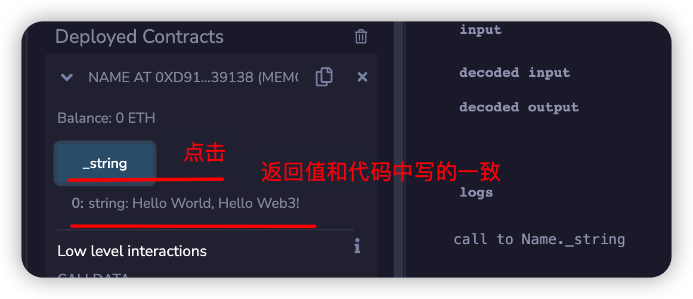

import QuizProgress from '@site/src/components/QuizProgress';
import QuizForm from '@site/src/components/QuizForm';

# Solidity入门:  2. Hello Web3 - 了解Solidity开发的流程

在上届课程中完成了Solidity开发环境构建之后，下面开始第一个Solidity程序，HelloWeb3. 这课程一下几个主要内容：

1. 初步感受编写智能合约
2. 学会如何部署智能合约/以及如何简单进行智能合约调试

## 编写HelloWeb3合约

这个其实非常简单，只要很少几行代码：

```solidity
// SPDX-License-Identifier: UNLICENSED

pragma solidity >=0.8.4;

contract Name {
    string public _string = "Hello World, Hello Web3!";
    constructor() {
       
    }
}
```

那么写完这个代码之后，这些代码有什么用处呢？怎么才能放到区块链上呢？
下面就需要实现智能合约的编译和部署的操作了.

## 智能合约编译和部署

使用`remix`来跑`solidity`合约。`remix`是以太坊官方推荐的智能合约开发IDE（集成开发环境），适合新手，可以在浏览器中快速部署测试智能合约，你不需要在本地安装任何程序。网址：[remix.ethereum.org](https://remix.ethereum.org)

同样编译和部署合约实际上不是只有remix一种，后续会介绍其他更适合开发者使用的方式。

## 编译部署智能合约

- 在remix创建helloweb3.sol文件

- 编译solidty合约

- 部署solidity合约

- 部署完成之后，可以看到这个合约地址

- 模拟调用合约


以上教程用非常快节奏的说明描述了一个合约的：
1. 编译
2. 部署
3. 调用
   
可以自己尝试一下以上的使用方式，从而为下面内容有更好的准备.
