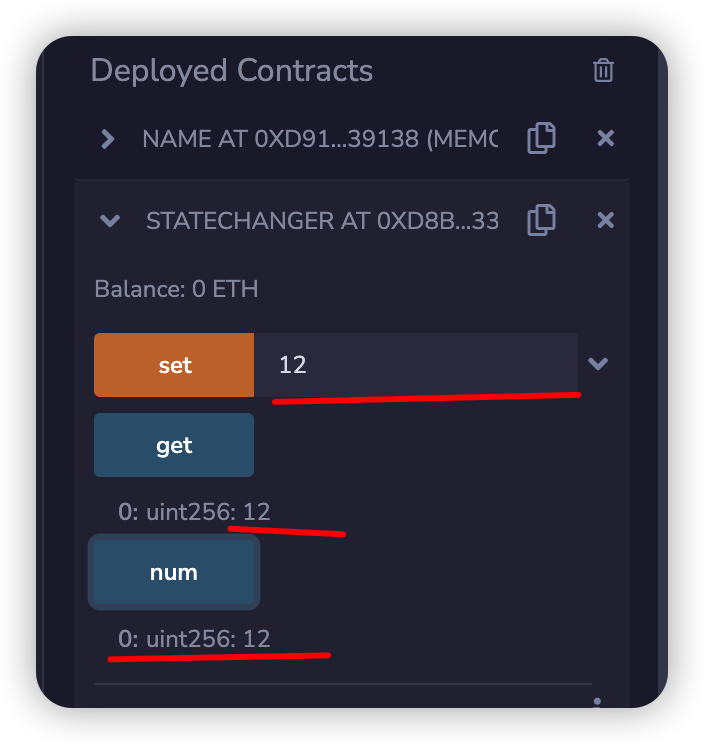
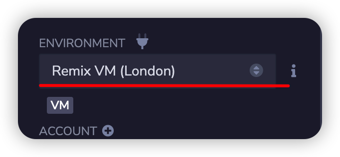
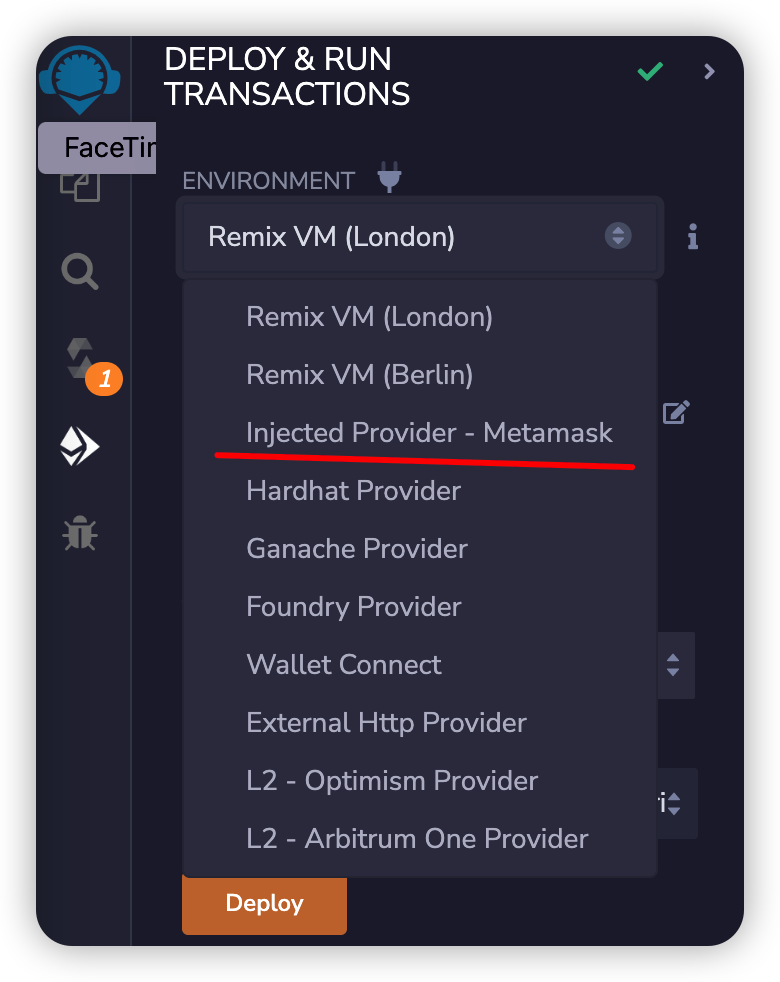

import QuizProgress from '@site/src/components/QuizProgress';
import QuizForm from '@site/src/components/QuizForm';

# Solidity入门:  2. Read/Write合约 - 了解Solidity合约中的读写流程

在上课程中完成了Solidity的最简单的HelloWeb3合约之后，下面开始第一个包含读写的Solidity程序，主要让同学们了解：

1. 初步了解合约读写功能
2. 了解读写功能在区块链合约中的区别

## 读写合约代码

```solidity
// SPDX-License-Identifier: UNLICENSED

pragma solidity ^0.8.4;

contract StateChanger {
    uint public num;
    function set(uint x) public {
        num = x;
    }

    function get() public view returns(uint) {
        return num;
    }
}

```
合约其实非常简单，包含以下几个功能:
1. `set` 设置num值
2. `get`获取num值
3. `num` 用来存储num值

合约编写完成之后，使用上一课讲的内容: [编译/部署/调用](../2-helloworld/README.mdx)

Read/Write: 读写合约
1. set num 为12
2. 调用get方法，获取值为12
3. num值为12


## 模拟正式区块链中的使用

以上例子几乎看不出读/写合约的在区块链上有任何区别，但是实际情况会有不同，主要为:
1. 读操作不需要花费手续费
2. 写操作需要花费手续费

可以将环境进行切换

切换为：


再进行读写操作，就可以感受到实际的不同了。

在使用过程中会出现需要测试手续费的问题，希望注意几点：
1. 确认链接的是测试网络，什么是测试网络？可以通过搜索引擎解决
2. 获取测试代币？可以通过搜索引擎解决

## 总结

几个问题：
1. 如何读合约变量数据
2. 如何设置合约中变量数据
3. 读写合约有什么区别
