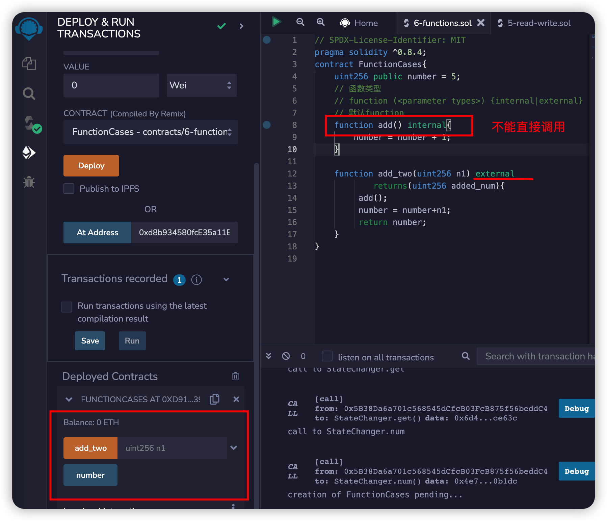
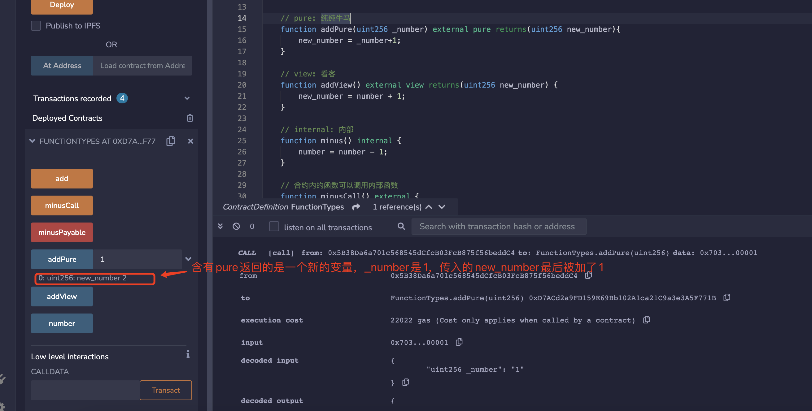
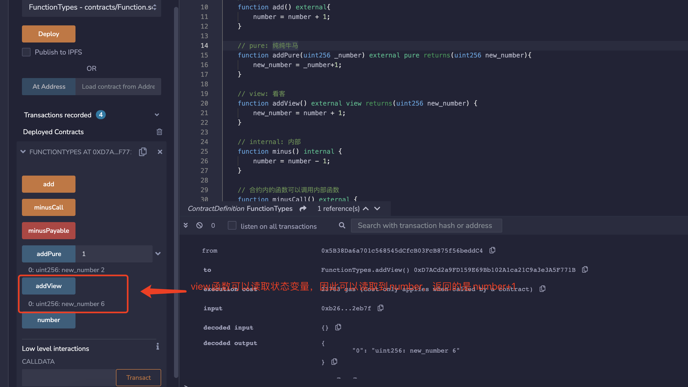
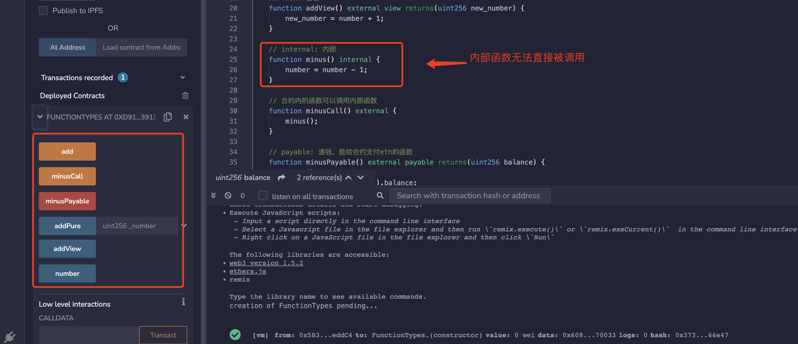
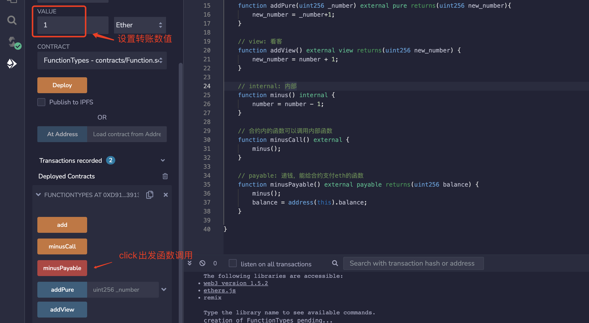

import QuizProgress from '@site/src/components/QuizProgress';
import QuizForm from '@site/src/components/QuizForm';

# Solidity入门: 5. 函数

Solidity中也有函数，那么什么是函数呢？

我们先学点英文:
```
A function is basically a group of code that can be reused anywhere in the program, which generally saves the excessive use of memory 
and decreases the runtime of the program
```

函数就是：
1. 一组代码
2. 这组代码可以被其他程序调用

他解决什么问题呢？
1. 减少些重复代码
2. 可以让很长很长的代码有好几个函数来组成，提高可维护性

函数也可以理解为：输入-》函数处理-》返回
1. input： 输入参数
2. 函数： 函数处理
3. output： 返回值

## Solidity中的函数

solidity官方文档里把函数归到数值类型，但我觉得差别很大，所以单独分一类。我们先看一下solidity中函数的形式：
```solidity
function function_name(parameter_list) scope returns(return_type) {
       // block of code
}
```
```solidity
function <function name> (<parameter types>) {internal|external|public|private} [pure|view|payable] [returns (<return types>)]
```

这个定义看着有些复杂,我们就一个一个看：
1. `function`：声明函数时的固定用法，想写函数，就要以function关键字开头。
2. ` <function name>`：函数名，调用函数的时候就会使用这个名字
3. `(<parameter types>)`：圆括号里写函数的参数，也就是要输入到函数的变量类型和名字，input
4. `{internal|external|public|private}`：scope，函数可见性说明符，一共4种。
    - `public`: 内部外部均可见。(也可用于修饰状态变量，public变量会自动生成 `getter`函数，用于查询数值).
    - `private`: 只能从本合约内部访问，继承的合约也不能用（也可用于修饰状态变量）。
    - `external`: 只能从合约外部访问（但是可以用`this.f()`来调用，`f`是函数名）
    - `internal`: 只能从合约内部访问，继承的合约可以用（也可用于修饰状态变量）。
5. `[pure|view|payable]`：决定函数权限/功能的关键字。`payable`（可支付的）很好理解，带着它的函数，运行的时候可以给合约转入`ETH`。`pure`和`view`的介绍见下一节。
6. `[returns ()]`：函数返回的变量类型和名称。

## 最简单的函数
下面用一个示例来表示上面提到的关键字(保留字)，在这个例子中：
1. 定义了一个add 函数

```solidity
// SPDX-License-Identifier: MIT
pragma solidity ^0.8.4;
contract FunctionCases{
    uint256 public number = 5;
    // 函数类型
    // function (<parameter types>) {internal|external} [pure|view|payable] [returns (<return types>)]
    // 默认function
    function add(){
        number = number + 1;
    }
}

```

从刚才的函数关键字定义中，有几个问题看看能不能回答：
1. add 函数的函数名是什么？```add```
2. add 函数的输入参数是什么？```空```
3. add 函数的返回值是什么？```没有```
4. add 访问的范围是什么？

很遗憾，上面的代码放到remix中进行编译，会报错。如果修改成
```solidity
  function add() public{
        number = number + 1;
    }
```

或者修改为任何一个提示函数访问范围的关键字程序编译都可以成功。
修改之后可以我们可以比较一下:


- external: 外部可以直接调用
- internal: 外部不显示，只能在内部调用
- public: 外部可以直接调用

留下一个问题： external修饰的函数，内部调用是否可以直接调用？还是需要用其他办法处理？

## 到底什么是`Pure`和`View`？

`pure`和`view`关键字，因为别的语言没有类似的关键字。`solidity`加入这两个关键字，是因为`gas fee`。合约的状态变量存储在链上，`gas fee`很贵，如果不改变链上状态，就不用付`gas`。包含`pure`跟`view`关键字的函数是不改写链上状态的，因此用户直接调用他们是不需要付gas的（合约中非`pure`/`view`函数调用它们则会改写链上状态，需要付gas）。

在以太坊中，以下语句被视为修改链上状态：

1. 写入状态变量
2. 释放事件
3. 创建其他合同
4. 使用`selfdestruct`
5. 通过调用发送以太币
6. 调用任何未标记`view`或`pure`的函数
7. 使用低级调用（low-level calls）
8. 使用包含某些操作码的内联汇编

英文原文，帮助理解: ```pure```和```view```
```shell
Modifying state variables.
Emitting events.
Creating other contracts.
Using self-destruct.
Sending Ether via calls.
Calling any function which is not marked pure or view.
Using inline assembly containing certain opcodes.
Using low-level calls.
```

- `pure`，中文意思是“纯”，在`solidity`里理解为“纯计算”。包含`pure`关键字的函数，不能读取也不能写入存储在链上的状态变量，只能根据输入进行计算,只能根据输入进行计算:
```solidity
function pure_func(uint256 temp) public pure returns(uint256 new_temp){
        return temp*2;
}
```
- `view`，“视图”，在`solidity`里理解为“视图”，类似数据库中```view```概念，只能读取，不能修改。包含`view`关键字的函数，能读取但也不能写入状态变量

- 不写`pure`也不写`view`，函数既可以读取也可以写入状态变量

## 代码
### 1. pure v.s. view

我们在合约里定义一个状态变量 `number = 5`。
```solidity
    // SPDX-License-Identifier: MIT
    pragma solidity ^0.8.4;
    contract FunctionTypes{
        uint256 public number = 5;
```
定义一个`add()`函数，每次调用，每次给`number + 1`。
```solidity
    // 默认
    function add() external{
        number = number + 1;
    }
```
如果`add()`包含了`pure`关键字，例如 `function add() pure external`，就会报错。因为`pure`（纯纯牛马）是不配读取合约里的状态变量的，更不配改写。那`pure`函数能做些什么？举个例子，你可以给函数传递一个参数 `_number`，然后让他返回 `_number+1`。
```solidity
    // pure: 纯纯牛马
    function addPure(uint256 _number) external pure returns(uint256 new_number){
        new_number = _number+1;
    }
```

**Example:**


如果`add()`包含`view`，比如`function add() view external`，也会报错。因为`view`能读取，但不能够改写状态变量。可以稍微改写下方程，让他不改写`number`，而是返回一个新的变量。
```solidity
    // view: 看客
    function addView() external view returns(uint256 new_number) {
        new_number = number + 1;
    }
```

**Example:**

### 2. internal v.s. external
```solidity
    // internal: 内部
    function minus() internal {
        number = number - 1;
    }

    // 合约内的函数可以调用内部函数
    function minusCall() external {
        minus();
    }
```
我们定义一个`internal`的`minus()`函数，每次调用使得`number`变量减1。由于是`internal`，只能由合约内部调用，而外部不能。因此，我们必须再定义一个`external`的`minusCall()`函数，来间接调用内部的`minus()`。
**Example:**


### 3. payable
```solidity
    // payable: 可支付，能给合约支付eth的函数
    function minusPayable() external payable returns(uint256 balance) {
        minus();    
        balance = address(this).balance;
    }
```
我们定义一个`external payable`的`minusPayable()`函数，间接的调用`minus()`，并且返回合约里的`ETH`余额（`this`关键字可以表示为引用的合约地址)。调用`minusPayable()`时，往合约里转入`ETH`。


我们可以在返回的信息中看到，合约的余额是1 ETH。


**Example:**


### return and returns

- return在函数中表示返回
- returns 定义函数返回的数据和类型

```solidity
function minusPayable() external payable returns(uint256 balance) {
        minus();    
        balance = address(this).balance;
        return balance;
    }
```


## 总结
在这一讲，我们介绍了`solidity`中的函数类型，比较难理解的是`pure`和`view`，在其他语言中没出现过。`solidity`引入`pure`和`view`关键字主要是为了节省`gas`和控制函数权限：如果用户直接调用`pure`/`view`方程是不消耗`gas`的（合约中非`pure`/`view`函数调用它们则会改写链上状态，需要付gas）。


