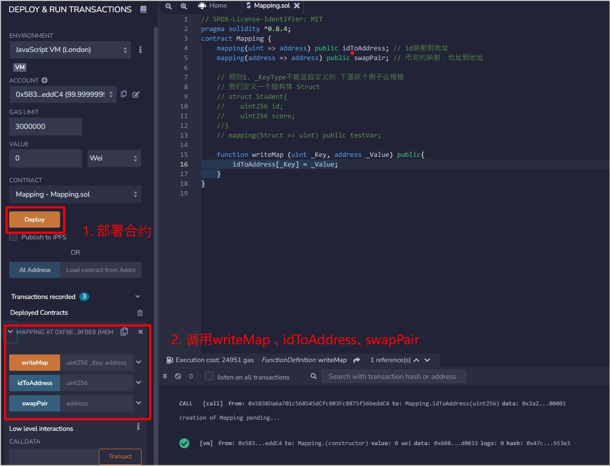
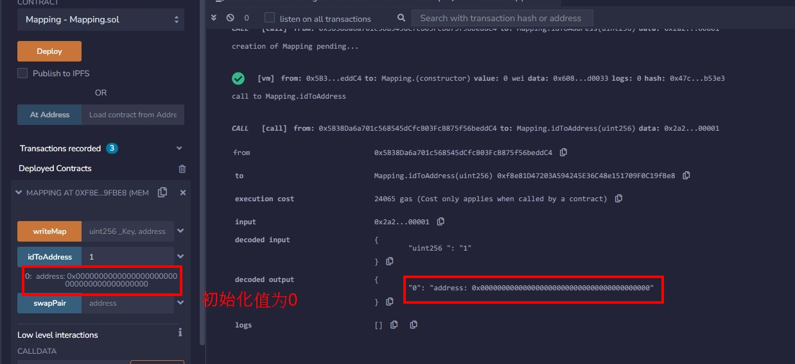
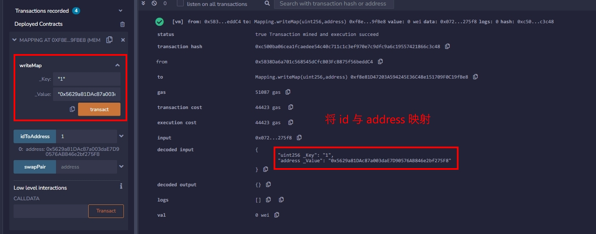

import QuizProgress from '@site/src/components/QuizProgress';
import QuizForm from '@site/src/components/QuizForm';

# Solidity入门: 8. 映射类型 mapping


这一讲，我们将介绍solidity中的哈希表：映射（`Mapping`）类型。
关于Mapping的用法，基本上可以参考其他语言的：
1. JAVA的Map
2. Python的dict
3. javascript的Map

简单讲就是一个key:value 的结构类型：
1. key需要是一个不可变的类型，如果key是可变的，那么数据就没有办法获取了
2. value可以任意的类型的值

Mapping是一个非常重要的数据结构，用法很简单，但是使用的地方非常多。

## 映射Mapping
在映射中，人们可以通过键（`Key`）来查询对应的值（`Value`），比如：通过一个人的`id`来查询他的钱包地址。

声明映射的格式为`mapping(_KeyType => _ValueType)`，其中`_KeyType`和`_ValueType`分别是`Key`和`Value`的变量类型。例子：
```solidity
    mapping(uint => address) public idToAddress; // id映射到地址
    mapping(address => address) public swapPair; // 币对的映射，地址到地址
```  
## 映射的规则
- **规则1**：映射的`_KeyType`只能选择`solidity`默认的类型，比如`uint`，`address`等，不能用自定义的结构体。而`_ValueType`可以使用自定义的类型。下面这个例子会报错，因为`_KeyType`使用了我们自定义的结构体：
```solidity
    // 我们定义一个结构体 Struct
    struct Student{
        uint256 id;
        uint256 score; 
    }
     mapping(Student => uint) public testVar;
```
- **规则2**：映射的存储位置必须是`storage`，因此可以用于合约的状态变量，函数中的`storage`变量，和library函数的参数（见[例子](https://github.com/ethereum/solidity/issues/4635)）。不能用于`public`函数的参数或返回结果中，因为`mapping`记录的是一种关系 (key - value pair)。

- **规则3**：如果映射声明为`public`，那么`solidity`会自动给你创建一个`getter`函数，可以通过`Key`来查询对应的`Value`。

- **规则4**：给映射新增的键值对的语法为`_Var[_Key] = _Value`，其中`_Var`是映射变量名，`_Key`和`_Value`对应新增的键值对。例子：
```solidity
    function writeMap (uint _Key, address _Value) public{
        idToAddress[_Key] = _Value;
    }
```
## 映射的原理
- **原理1**: 映射不储存任何键（`Key`）的资讯，也没有length的资讯。

- **原理2**: 映射使用`keccak256(key)`当成offset存取value。

- **原理3**: 因为Ethereum会定义所有未使用的空间为0，所以未赋值（`Value`）的键（`Key`）初始值都是0。

## 在Remix上验证 (以 `Mapping.sol`为例)
- 映射示例 1 部署

    

- 映射示例 2 初始值

    

- 映射示例 3 key-value pair

    


## 总结
这一讲，我们介绍了`solidity`中哈希表——映射（`Mapping`）的用法。至此，我们已经学习了所有常用变量种类，之后我们会学习控制流`if-else`,` while`等。

