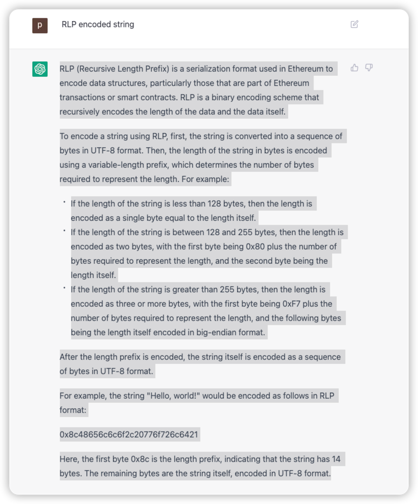
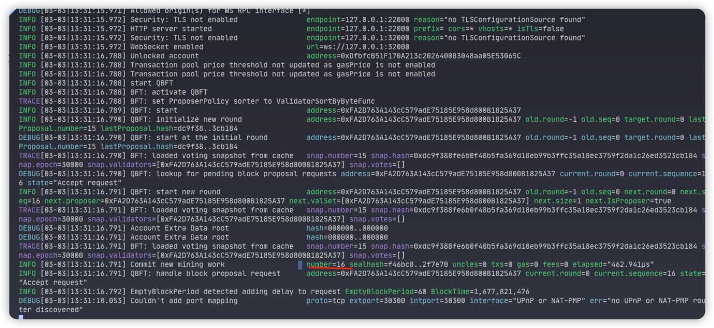

# 

## RLP Encoded String 



## generate nodes and genesis file

```shell
npx quorum-genesis-tool --consensus qbft --chainID 133766 \
--blockperiod 5 --requestTimeout 10 --epochLength 30000 --difficulty 1 \
--gasLimit '0xFFFFFF' --coinbase '0x0000000000000000000000000000000000000000' \
--validators 1 --members 0 --bootnodes 0 --outputPath 'artifacts'
```

## run a node


