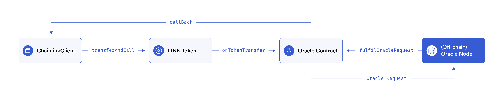
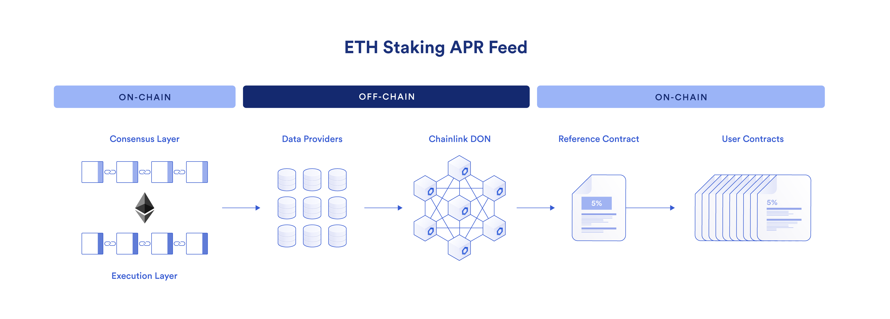
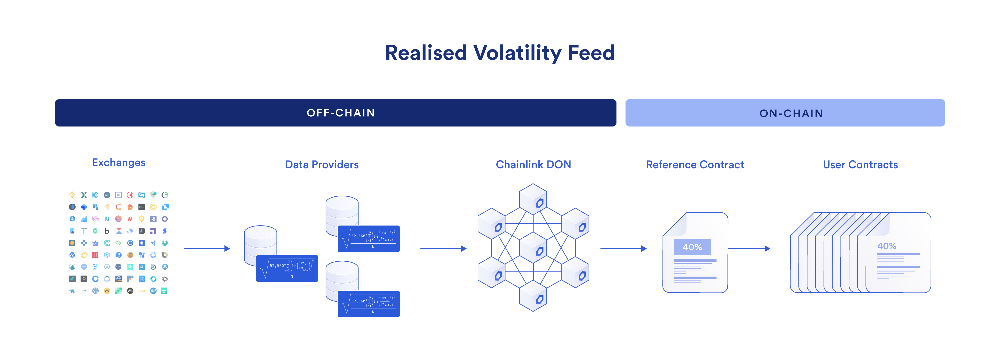

# TO DO List

- [X] Run Chainlink Node for EVM Network
- [X] Data Feed Examples: 智能合约计算和获取数据
- [] Aggeragator Examples: 智能合约统计汇总数据，计算透明
- [] Job Examples: 
- [] Function Examples
- [] Aumation Examples

## Run Chainlink Node for EVM Network

-  Fork Other network into local
```sh
npx hardhat node --fork https://mainnet.infura.io/v3/<key> --fork-block-number 14390000
```
```sh
npx hardhat chainlink:run-node
````
username - user@hardhatchainlink.io
password - strongpassword777

## Data Feeds Address

- [data-feeds-address](https://docs.chain.link/data-feeds/price-feeds/addresses)
- [DataFeedAddress Contract](./contracts/PriceFeed.sol)
- [Calling DataFeedAddress Contract](./scripts/datafeeds-requests.ts)

## Run Fee


## Overview

## Basic Rquest Model



- 通过LinkToken代理访问Oracle合约: LinkToken转账之后出发OnTokenTransfer开始调用数据获取合约
- Oracle合约访问Oracle off-chain 网络, Oracle Replayer监听事件
- Oracle off-chain网络 简化版区块链，P2P网络，传递信息





## Products

- Data Feeds
- AnyAPI: 直接合约获取数据,不通过 
- VRF: 随机获取数据
- Automation: 根据设定条件自动化执行某些合约
- Functions: 不用配置节点,直接使用，如果有直接可以使用的数据，不需要任何加工就可以使用